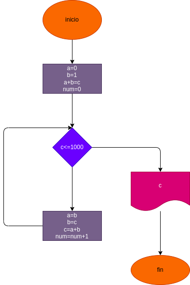

# Serie_Fibonacci
## la serie fibonacci es una secuencia numerica, en la cual cada elmentos es igual a la suma de los dos anteriores. tomando como variables iniciales sus dos primeros elementos a=0 b=1, hacer el diagrama y el programa que calcule e imprima a partir del tercero todos los elementos de la serie fibonacci que sean menores que 1000
## Diagrama de flujo
